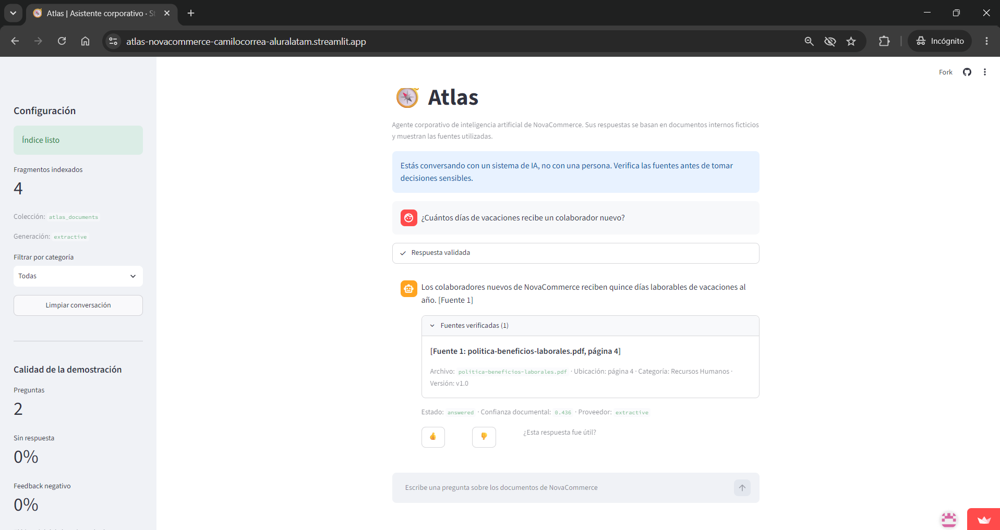
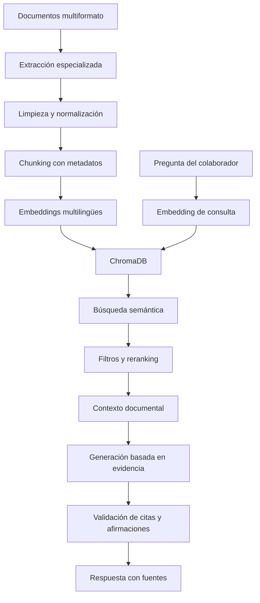

# 🧭 Atlas — Agente corporativo de conocimiento con RAG

[](https://atlas-novacommerce-camilocorrea-aluralatam.streamlit.app/)
[](https://github.com/camilo2002-ux/atlas-ai-corporate-agent/actions/workflows/tests.yml)


**Atlas** es un agente corporativo de inteligencia artificial desarrollado para la empresa ficticia **NovaCommerce**. Su objetivo es ayudar a los colaboradores a consultar información interna mediante una interfaz conversacional, recuperando evidencia desde documentos y mostrando las fuentes utilizadas.

## 🌐 Aplicación desplegada

**Demo pública:**  
https://atlas-novacommerce-camilocorrea-aluralatam.streamlit.app/

> Todos los nombres, políticas, cifras y documentos utilizados son ficticios y fueron creados exclusivamente con fines educativos.

## 📸 Ejecución en la nube



El registro de validación del despliegue está disponible en [`docs/execution-log.md`](docs/execution-log.md).

## 🎯 Problema que resuelve

En una organización, la información suele estar distribuida en documentos de Recursos Humanos, Finanzas, Operaciones, Tecnología, Estrategia y Legal. Encontrar una respuesta puede requerir abrir varios archivos y revisar versiones diferentes.

Atlas centraliza este conocimiento mediante una arquitectura **RAG** (*Retrieval-Augmented Generation*), que permite:

- buscar información por significado y no solo por palabras exactas;
- filtrar resultados mediante metadatos;
- recuperar los fragmentos documentales más relevantes;
- mostrar el archivo y la ubicación de origen;
- evitar respuestas cuando la evidencia es insuficiente;
- registrar feedback y métricas para mejorar el sistema.

## ✨ Funcionalidades

- Chat web desarrollado con Streamlit.
- Aviso visible de que se conversa con un sistema de IA.
- Historial de conversación durante la sesión.
- Filtro por categoría documental.
- Respuestas acompañadas por fuentes verificables.
- Ubicación de la evidencia por página, fila, hoja, diapositiva, sección o ruta JSON.
- Feedback positivo y negativo.
- Métricas básicas de calidad.
- Fallback explícito cuando no existe evidencia suficiente.
- Creación automática del índice vectorial al iniciar en un entorno limpio.
- Pipeline de actualización documental.
- Pruebas automatizadas del flujo completo.

## 📄 Formatos soportados

| Formato | Extensión | Información preservada |
|---|---|---|
| PDF | `.pdf` | Página |
| Word | `.docx` | Párrafos, títulos y tablas |
| Excel | `.xlsx` | Hoja, encabezados y filas |
| PowerPoint | `.pptx` | Diapositiva |
| Markdown | `.md` | Secciones |
| CSV | `.csv` | Encabezados y registros |
| JSON | `.json` | Rutas y estructuras |
| HTML | `.html` | Secciones y texto limpio |

Los PDF digitales son procesados directamente. Los PDF formados únicamente por imágenes pueden requerir una integración OCR adicional.

## 🧠 Arquitectura



## 🔎 Flujo RAG

1. Atlas detecta el formato del documento.
2. Un extractor especializado obtiene el contenido y su ubicación.
3. El texto se limpia y divide en fragmentos.
4. Cada fragmento conserva metadatos como categoría, archivo, versión y responsable.
5. FastEmbed genera embeddings multilingües.
6. ChromaDB almacena vectores, textos y metadatos.
7. La pregunta se transforma utilizando el mismo modelo de embeddings.
8. Atlas recupera candidatos por similitud semántica.
9. Los candidatos se filtran y reclasifican mediante un reranker híbrido.
10. Los mejores fragmentos forman el contexto documental.
11. La respuesta se valida para comprobar citas, números y respaldo textual.
12. Si la evidencia no es suficiente, Atlas lo informa sin inventar una respuesta.

## 🛠️ Tecnologías

- Python
- Streamlit
- ChromaDB
- FastEmbed
- ONNX Runtime
- pypdf
- python-docx
- openpyxl
- python-pptx
- Beautiful Soup
- pytest
- Docker y Docker Compose
- GitHub Actions
- Streamlit Community Cloud

El proyecto también contiene una integración opcional con OCI Generative AI, configurable mediante variables de entorno.

## 📁 Estructura principal

```text
atlas-ai-corporate-agent/
├── .github/workflows/       # Integración continua
├── .streamlit/              # Configuración de Streamlit
├── data/                    # Datos generados e índices locales
├── deploy/                  # Archivos de despliegue alternativo
├── docs/                    # Documentación y evidencias
├── knowledge-base/          # Inventario documental
├── scripts/                 # Comandos del pipeline
├── src/atlas/
│   ├── app/                 # Runtime de la aplicación
│   ├── generation/          # Generación y validación
│   ├── indexing/            # Embeddings y base vectorial
│   ├── maintenance/         # Actualización de documentos
│   ├── monitoring/          # Eventos, feedback y métricas
│   ├── processing/          # Extracción, limpieza y chunking
│   └── rag/                 # Recuperación, reranking y contexto
├── tests/                   # Pruebas automatizadas
├── streamlit_app.py         # Aplicación principal
├── Dockerfile
├── docker-compose.yml
└── requirements.txt
```

## 🚀 Ejecución local

### Requisitos

- Python 3.11 o superior
- Git

### 1. Clonar el repositorio

```bash
git clone https://github.com/camilo2002-ux/atlas-ai-corporate-agent.git
cd atlas-ai-corporate-agent
```

### 2. Crear y activar el entorno virtual

Linux, macOS o Codespaces:

```bash
python -m venv .venv
source .venv/bin/activate
```

Windows PowerShell:

```powershell
python -m venv .venv
.venv\Scripts\Activate.ps1
```

### 3. Instalar las dependencias

```bash
python -m pip install --upgrade pip
pip install -r requirements-dev.txt
```

### 4. Crear la configuración local

Linux, macOS o Codespaces:

```bash
cp .env.example .env
```

Windows PowerShell:

```powershell
Copy-Item .env.example .env
```

La demostración local puede utilizar:

```env
ATLAS_LLM_PROVIDER=extractive
ATLAS_BOOTSTRAP_DEMO=true
ATLAS_LOG_QUERY_TEXT=false
```

### 5. Iniciar Atlas

```bash
streamlit run streamlit_app.py
```

La aplicación crea automáticamente el índice demostrativo cuando todavía no existe.

## 🧪 Pruebas

Ejecutar:

```bash
pytest
```

Resultado validado durante el desarrollo:

```text
24 passed
```

Las pruebas cubren:

- extracción de los ocho formatos;
- limpieza y chunking;
- metadatos;
- embeddings e indexación;
- búsqueda semántica;
- filtros;
- reranking;
- construcción del contexto RAG;
- generación basada en evidencia;
- validación de citas y cifras;
- fallback sin evidencia;
- runtime de la interfaz;
- feedback, métricas y mantenimiento.

GitHub Actions vuelve a ejecutar automáticamente las pruebas con cada `push` a la rama `main` y en cada *pull request*.

## 💬 Preguntas para probar la demo

### Recursos Humanos

```text
¿Cuántos días de vacaciones recibe un colaborador nuevo?
```

### Finanzas

Selecciona la categoría **Finanzas** y pregunta:

```text
¿Cuál es el límite permitido para alojamiento?
```

### Tecnología

```text
¿Cómo se escala un incidente técnico grave?
```

### Operaciones

```text
¿Cuál es la capacidad del centro de distribución de Quito?
```

### Prueba sin evidencia

```text
¿Cuál es el presupuesto para construir una base en Marte?
```

Atlas debe reconocer que la documentación disponible no contiene evidencia suficiente.

## ☁️ Despliegue

La demostración pública utiliza:

| Configuración | Valor |
|---|---|
| Plataforma | Streamlit Community Cloud |
| Rama | `main` |
| Archivo principal | `streamlit_app.py` |
| Python | 3.12 |
| Proveedor de respuesta | `extractive` |
| Bootstrap automático | Activado |
| Registro del texto de preguntas | Desactivado |

Community Cloud instala las dependencias del repositorio e inicia la aplicación. Cuando el entorno no contiene un índice vectorial, Atlas crea automáticamente el índice de demostración.

## 📊 Monitoreo y mantenimiento

Atlas incluye:

- eventos de preguntas respondidas;
- registro de feedback;
- tasa de preguntas sin respuesta;
- tasa de feedback negativo;
- latencia promedio;
- confianza documental promedio;
- proceso de reconstrucción segura del índice;
- colección temporal de *staging* antes de publicar una actualización.

Para proteger la privacidad, la configuración predeterminada usa:

```env
ATLAS_LOG_QUERY_TEXT=false
```

Esto permite recopilar métricas sin guardar el texto completo de las preguntas.

## 🔐 Seguridad

- `.env` está excluido del repositorio.
- No se almacenan contraseñas, tokens ni claves privadas.
- Los documentos y datos de la demostración son ficticios.
- El contenido recuperado se trata como evidencia, no como instrucciones.
- Las respuestas deben incluir citas válidas.
- Las cifras de una respuesta se comparan con las fuentes.
- Ante evidencia insuficiente, Atlas utiliza un fallback seguro.

## ⚠️ Estado y limitaciones

La aplicación desplegada utiliza un índice demostrativo de cuatro fragmentos para mantener un arranque reproducible y adecuado para una demo pública.

El proveedor `extractive` selecciona una oración respaldada por la evidencia. El proyecto contiene una integración opcional con OCI Generative AI, pero la demo pública no utiliza credenciales ni servicios de pago.

Otras limitaciones actuales:

- El almacenamiento de Streamlit Community Cloud puede ser efímero.
- La sesión de conversación no se comparte entre usuarios.
- Los PDF escaneados requieren OCR.
- La demo no incorpora todavía los ocho documentos corporativos completos.
- Antes de utilizar información real serían necesarios controles adicionales de acceso, privacidad y gobierno documental.

## 🗺️ Próximas mejoras

- Crear los ocho documentos corporativos ficticios completos.
- Construir un conjunto de evaluación de al menos 25 preguntas.
- Incorporar evaluación automática de recuperación y respuestas.
- Añadir OCR opcional.
- Integrar almacenamiento externo persistente.
- Crear un panel de observabilidad.
- Añadir actualización programada de documentos.
- Comparar distintos modelos de embeddings y reranking.
- Activar un LLM generativo después de evaluar calidad, seguridad y costo.

## 👤 Autor

Proyecto desarrollado por **Camilo Correa** para el desafío **Alura Agentes / Oracle Next Education**.

## 📄 Licencia

Este proyecto se distribuye bajo la [licencia MIT](LICENSE).
